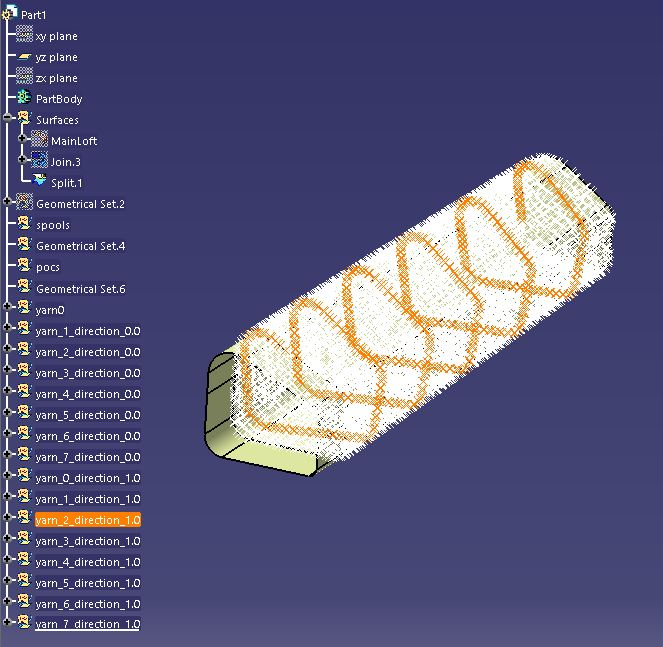

# kiBraid
kinematic braiding simulation using CATIA file as input and for visualization

## Installation
CATIA should be already installed on the system. The library can be cloned into any folder. Installing python libraries through requirements.txt should be possible “pip install -r requirements.txt”.

## Test Run
To run the simulation user should run "braidGui.py". The user should find _test_A005_JK using the browse function, the file is provided within the repository under "testfiles".
The test-run parameters should be as follows (spools: 8, span: 300, mesh size: 0.8, mandrel speed: 2, guide radius: 500).
The result should look similar to figure 1. Points for each yarn can be highlighted by selecting geometry set.

#### Figure 1 – example result 
The numerical results are available in braid_data.csv in the main folder. The column data in the .csv file are as follows: Yarn, x,y,z,xN,yN,zN,braid angle,braid pitch, yarn rotation direction. The x,y,z coordinates are the local surface point coordinates. The xN,yN,zN define the normal to the surface at that point.

## CATIA inputs
The files used as inputs need to follow several standards.
 1.shape needs to start at z=0
 2.the shape need centreline starting at x=0,y=0
 3.all geometries need to be hidden
 4.the complete surface needs to be called "MainLoft" and should be located in geometrical set called“Surfaces”.
## Other notes
The details of how the simulation works are provided as annotations.
## References
The core formulas for the braiding simulation were taken from:
Van Ravenhorst JH., 2018. DESIGN TOOLS FOR CIRCULAR OVERBRAIDING OF COMPLEX MANDRELS [Internet]. [cited 2019 Feb 21]. Available from: https://ris.utwente.nl/ws/portalfiles/portal/46645249/PhD_thesis_Johan_van_Ravenhorst.pdf

